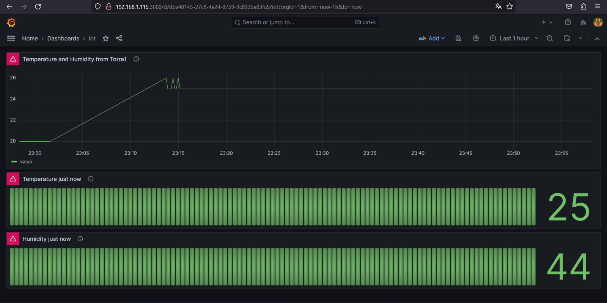
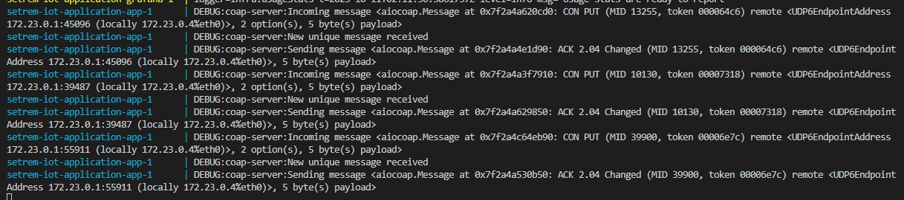

# setrem-iot-application
Este repositório representa a aplicação responsável por exibir em gráficos os dados coletados e recebidos do Raspberry PI (sensores).

A aplicação é composta por:
- Aplicação Python: Utiliza protocolo coap para receber dados de leitura de sensores. Após receber conteúdo, grava na base de dados (MySQL).
- MySQL: É inicializado via compose já com as databases e tabelas necessárias.
- Grafana: Exibição dos dados através de Dashboard (obtém dados via leitura na base de dados).

## Onde executar?
Inicialmente estamos subindo o recurso via Docker Compose em um servidor local na mesma rede LAN onde o Raspberry PI está conectado. Porém, da forma que foi estruturado, podemos provisionar esta aplicação em containers em outros locais.

```sh
docker compose up --build
```

O comando acima irá criar todos os recursos necessários.
A porta 3000 do Grafana é exposta "externamente" (fora dos containers), assim é possível visualizar os dashboards a partir de outros dispositivos na mesma rede LAN.

## Visualização dos dados

Na imagem abaixo temos um exemplo da exibição dos dados do sensor via Dashboard no Grafana.



Aqui também temos uma imagem do output do docker compose, mostrando os logs dos containers:

